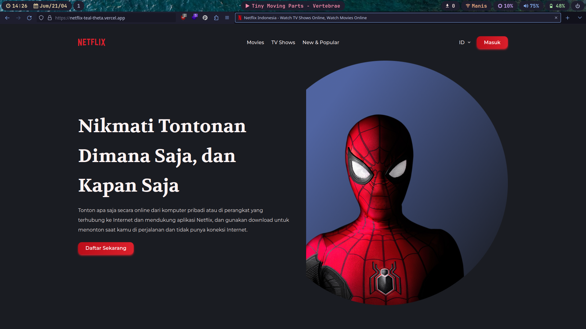
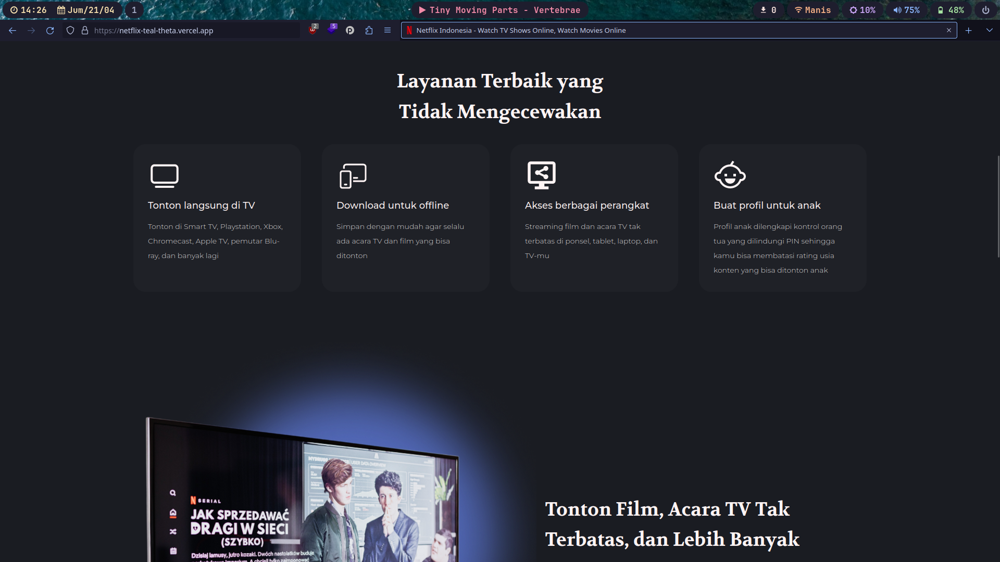
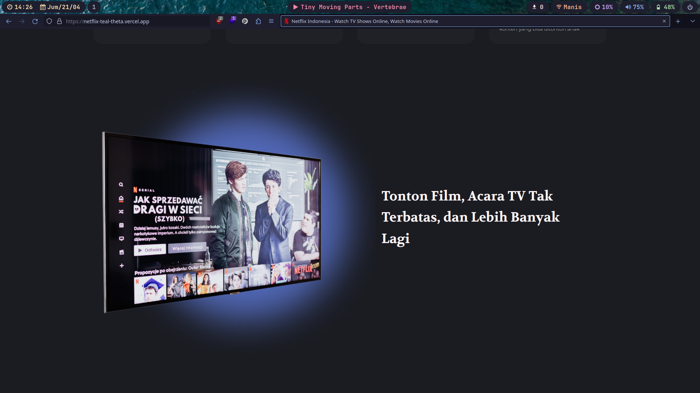
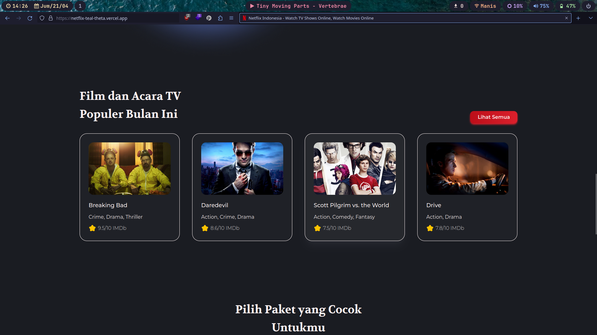
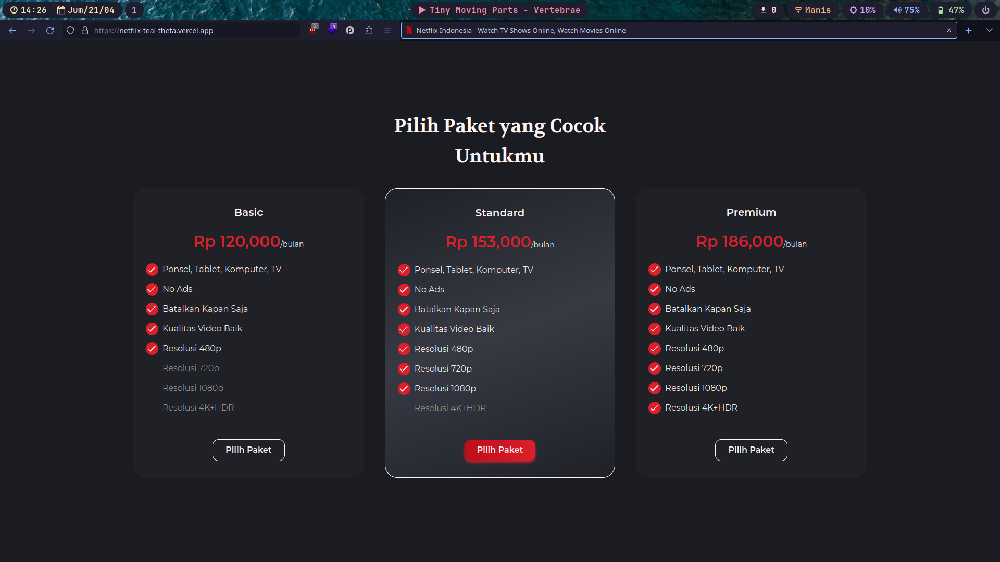
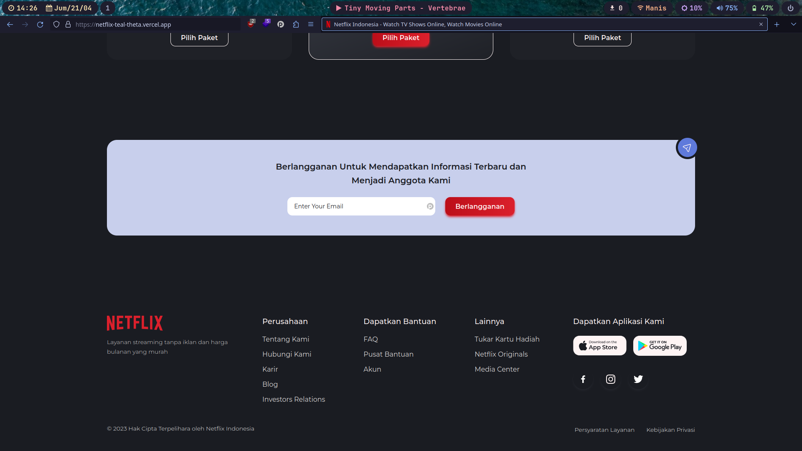

# Netflix Clone

Netflix Landing Page slicing challenge for https://codedesign.dev

## Preview








## Built with

- Uno CSS
- Vite
- Alpine.js

## Getting Started

### Prerequisites

- Node.js
- pnpm

### Installation

```sh
git clone https://github.com/tfkhdyt/netflix-clone
cd netflix-clone
pnpm i
```

### Usage

```sh
# run in development
pnpm dev

# build project
pnpm build

# run in production
pnpm preview

# format the code
pnpm format
```
